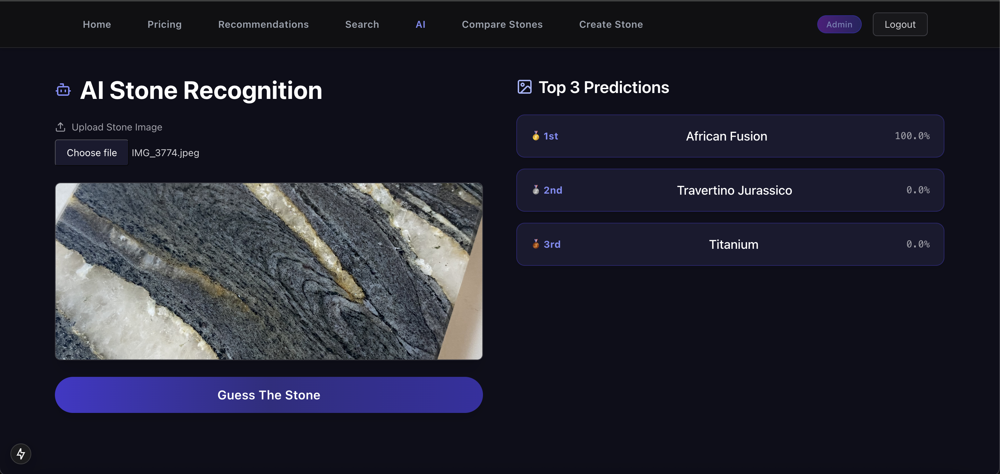

# 🪨 StoneGuide

**StoneGuide** is a full-stack, AI-powered web application for exploring, comparing, recommending, and pricing natural stones used in kitchens, bathrooms, stairs, and more. The platform is secure, production-ready, and built using modern DevOps practices.

> **Status**: ✅ Production-ready · ✅ Full frontend/backend complete · ✅ AI module integrated · ✅ Deployed on Kubernetes

---

## 🔐 Security

- OAuth 2.0 with **Keycloak** for secure authentication
- Fine-grained **role-based access control** (e.g., user, admin)
- JWT-secured REST API (`express-jwt` + `jwks-rsa`)
- Helmet, CORS, and security headers enforced

---

## ⚙️ Infrastructure & DevOps

- **Microservice architecture** (MongoDB, Redis, Backend, Frontend, AI module, Keycloak)
- **Kubernetes-native** deployment for production (manifests included)
- **CI/CD** pipeline via **GitHub Actions** for testing & deployment
- Healthchecks, environment secrets, and hot reload support

---

## 💡 Core Functionality

- **Stone explorer** with advanced filtering (color, type, usage, price range)
- **Smart pricing engine** with unit conversion, thickness options, and multi-currency support
- **Stone comparison** feature
- **Admin panel** to add new stones (restricted to admin role)
- **Swagger API Documentation** for all endpoints

---

## 🧠 AI Stone Recognition

- **Model**: `ResNet50` trained on a custom dataset (real stone photos + augmentation)
- **AI service**: Flask microservice served at `/ai`
- **Frontend integration**: Upload a photo → receive top 3 predictions with full metadata

---

### 🔍 Demo — AI Stone Recognition

Upload a photo of a stone to get predictions from the trained ResNet50 model.



---

## 📁 Project Structure

```bash
/backend
├── coverage/              # Jest coverage reports
├── logs/                  # Winston logs
├── src/
│   ├── config/            # DB, Redis, Keycloak, etc.
│   ├── controllers/       # Route controllers
│   ├── middlewares/       # Auth, error handling, logging
│   ├── models/            # Mongoose schemas
│   ├── routes/            # Express routers
│   ├── services/          # Business logic
│   └── utils/             # Validation, conversion, helpers
├── tests/                 # Unit & integration tests
├── Dockerfile
└── server.js

/frontend
├── public/                # Static assets
└── src/
    ├── app/               # Next.js routing
    │   ├── ai/            # AI upload & results
    │   ├── add-stone/     # Admin-only stone form
    │   ├── callback/      # Keycloak redirect
    │   ├── compare/       # Stone comparison view
    │   ├── dashboard/     # Landing/home
    │   ├── pricing/       # Price calculator
    │   ├── recommendations/ # Suggestions view
    │   ├── search/        # Search UI
    │   └── layout.tsx     # Shared layout
    ├── components/        # Navbar, Auth modal, etc.
    ├── utils/             # Auth, debounce, token helpers
    └── styles/            # Tailwind & MUI customizations
Dockerfile

/ai-module
├── main.py                # Entry Flask server
├── app/
│   ├── routes.py
│   └── utils.py
├── model/                 # Trained model files
├── tests/                 # Unit tests
├── Dockerfile
└── requirements.txt

/k8s/                      # Kubernetes manifests
├── backend.yaml
├── frontend.yaml
├── ai-module.yaml
├── mongo.yaml
├── redis.yaml
└── keycloak.yaml
```

---

## ☁️ Deploying to Kubernetes

```bash
# Deploy all services
kubectl apply -f k8s/

# Check pods and services
kubectl get pods
kubectl get svc

```

---

## 👨‍💻 Author

Built by [@qlpak](https://github.com/qlpak) as a solo full-stack project.

---

## 📜 License

This project is **closed-source**. All rights reserved.
