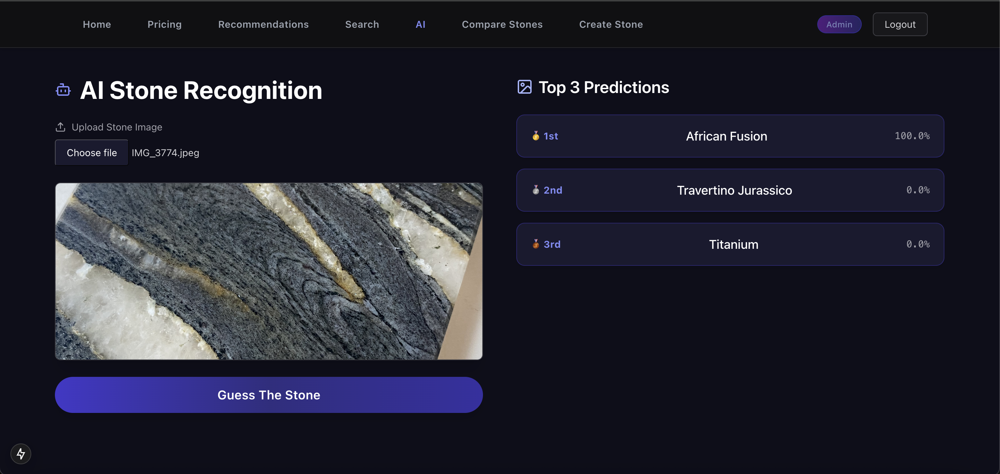

<div align="center">

# StoneGuide

### AI-Powered Natural Stone Discovery & Pricing Platform

[](https://nextjs.org/)
[](https://nodejs.org/)
[](https://python.org/)
[](https://tensorflow.org/)
[](https://kubernetes.io/)
[](https://docker.com/)
[](https://mongodb.com/)
[](https://redis.io/)
[](https://keycloak.org/)

[](https://github.com/features/actions)
[](https://ansible.com/)
[](https://oauth.net/2/)
[](https://github.com/qlpak/stone-guide-app)

**Full-stack microservice platform for exploring, comparing, and pricing natural stones with AI-powered image recognition.**

[Features](#-features) • [Quick Start](#-quick-start) • [Documentation](#-documentation) • [Tech Stack](#-tech-stack)

</div>

---

## Features

### Stone Discovery

Advanced filtering by color, type, usage, and price range with real-time search results.

### Smart Pricing

Intelligent price calculator with multi-currency support (USD, EUR, PLN) and thickness options.

### Comparison Tools

Side-by-side comparison of up to 3 stones with detailed specifications and smart recommendations.

### AI Recognition

Upload stone photos to get instant AI predictions using fine-tuned **ResNet50** model with 90%+ accuracy.

### Secure Access

OAuth 2.0 authentication via Keycloak with role-based access control (user/admin).

### API Documentation

Full REST API with Swagger/OpenAPI documentation at `/api-docs`.

---

## Quick Start

### Prerequisites

- **Docker** & **Docker Compose**
- **kubectl** (for Kubernetes)
- **Ansible** (for automated deployment)

### Local Development

```bash
# Clone repository
git clone https://github.com/qlpak/stone-guide-app.git
cd stone-guide-app

# Start all services
docker-compose up -d

# Verify services
docker-compose ps
```

**Access the application**:

- Frontend: http://localhost:3000
- Backend API: http://localhost:5001
- AI Module: http://localhost:5002
- Keycloak: http://localhost:8080

### Verify Environment

```bash
./verify-env.sh
```

**For detailed development setup** including environment configuration, development commands, database access, and debugging tips:

**→ See [Development Guide](docs/development.md)**

---

## Documentation

Detailed guides available in the `docs/` directory:

| Guide                                  | Description                                                     |
| -------------------------------------- | --------------------------------------------------------------- |
| **[Development](docs/development.md)** | Local setup, environment variables, and development commands    |
| **[Deployment](docs/deployment.md)**   | Docker Compose, Ansible, and Kubernetes deployment instructions |
| **[CI/CD](docs/ci-cd.md)**             | GitHub Actions workflows and automated testing                  |

---

## Tech Stack

### Frontend

- **Next.js 14** (App Router, TypeScript)
- **Tailwind CSS** + Material-UI
- **React Query** for state management

### Backend

- **Node.js** + Express
- **MongoDB** (Mongoose ODM)
- **Redis** (caching layer)
- **Winston** (logging)

### AI Module

- **Python 3.10** + Flask
- **TensorFlow 2.x** + Keras
- **ResNet50** (transfer learning)

### Infrastructure

- **Docker** & Kubernetes
- **Ansible** (IaC automation)
- **NGINX** Ingress Controller
- **GitHub Actions** (CI/CD)

### Security & Auth

- **Keycloak** (OAuth 2.0 / OIDC)
- **JWT** tokens with RBAC
- **Helmet.js** + CORS

---

## Security

- **OAuth 2.0 / OpenID Connect** via Keycloak
- **JWT-based authentication** with asymmetric key verification
- **Role-based access control** (user, admin)
- **Helmet.js** security headers
- **Input validation** with Joi schemas
- **Rate limiting** with Redis

---

## Project Structure

```
stone-guide-app/
├── docs/                   # Documentation
│   ├── development.md
│   ├── deployment.md
│   └── ci-cd.md
├── backend/                # Node.js API
├── frontend/               # Next.js app
├── ai-module/              # Python/Flask AI service
├── k8s/                    # Kubernetes manifests
├── keycloak-custom/        # Keycloak configuration
├── .github/workflows/      # CI/CD pipelines
├── deploy.yaml             # Ansible playbook
├── docker-compose.yml      # Local development
└── README.md
```

---

## AI Stone Recognition

### How It Works

1. **Upload** a photo of any natural stone
2. **AI analyzes** the image using ResNet50
3. **Get predictions** with confidence scores and full stone metadata

### Model Details

- **Architecture**: ResNet50 (transfer learning)
- **Framework**: TensorFlow / Keras
- **Dataset**: Custom stone images + data augmentation
- **Accuracy**: 80%+ top-1, 95%+ top-3
- **Input**: 224x224 RGB images
- **Output**: Top-3 predictions with confidence scores



---

## Deployment

**Automated deployment with Ansible or manual Kubernetes deployment.**

For complete deployment instructions including:

- Local development with Docker Compose
- Ansible playbook deployment (recommended)
- Manual Kubernetes deployment
- Production configuration and troubleshooting

**→ See [Deployment Guide](docs/deployment.md)**

---

## CI/CD

**Automated testing and continuous integration with GitHub Actions.**

Three independent pipelines for Backend, Frontend, and AI Module with automated testing, coverage reporting, and quality checks.

**→ See [CI/CD Guide](docs/ci-cd.md)**

---

## Architecture

Microservice architecture with 6 core services:

```
           Ingress (NGINX)
                 │
     ┌───────────┼───────────┐
     │           │           │
  Frontend    Backend    AI Module
  (Next.js)  (Node.js)   (Flask)
     │           │           │
     └─────┬─────┴─────┬─────┘
           │           │
    ┌──────┴─────┬────-┴────┐
    │            │          │
  MongoDB      Redis    Keycloak
```

---

## Author

<div align="center">

**Built by [@qlpak](https://github.com/qlpak)**

_Full-stack solo project showcasing modern cloud-native development_

</div>

---

## License

This project is **closed-source**. All rights reserved.
